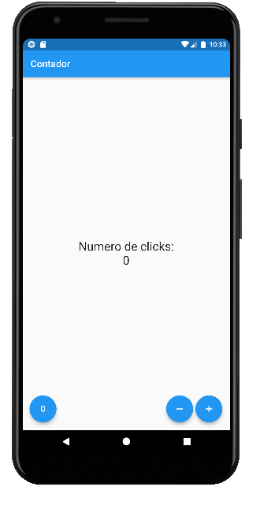

# Apicación Móvil: Contador

Esta aplicación implementa un contador en el cuál se puede sumar y restar una unidad y regresar a cero el estado del contador. La aplicación usa el lenguaje <a href="">Dart</a> y fue desarrollada usando el framework <a href="">Flutter</a>. A continuación se muestra la pantalla de la aplicación:

La aplicación fue desarrollada como parte del curso <a href="https://www.udemy.com/course/flutter-primeros-pasos/">Flutter: Una introducción al SDK de Google</a>.
